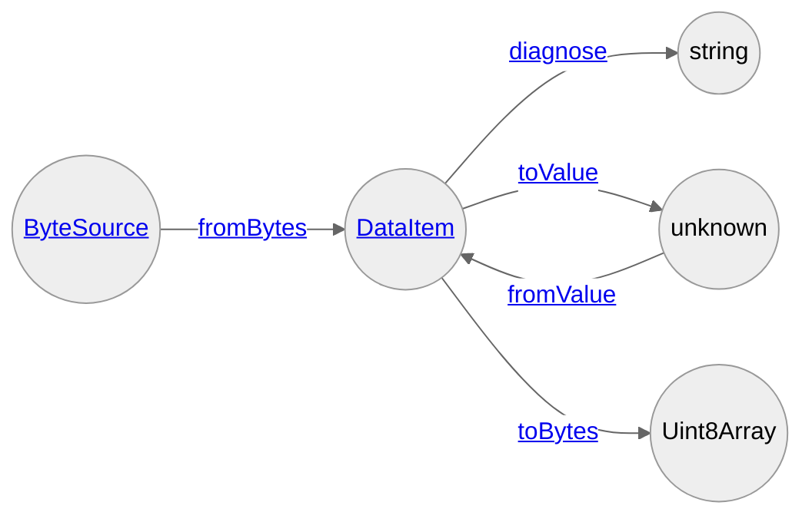

# Lossless CBOR

A zero-dependency library to encode and decode CBOR ([RFC8949](https://www.rfc-editor.org/rfc/rfc8949)) for TypeScript. It preserves the semantics of original data as much as possible.

Supported CBOR features notable:

- **[Generic encoding and decoding](https://www.rfc-editor.org/rfc/rfc8949.html#name-generic-encoders-and-decode)** — This is why it's lossless.
- [Indefinite-length byte strings, text strings, arrays, and maps](https://www.rfc-editor.org/rfc/rfc8949.html#name-indefinite-lengths-for-some)
- [Preferred serialization and deterministic encoding](https://www.rfc-editor.org/rfc/rfc8949.html#name-serialization-consideration)
- Some tags defined in RFC8949
  - [Standard date/time string](https://www.rfc-editor.org/rfc/rfc8949.html#name-standard-date-time-string)
  - [Epoch-based date/time](https://www.rfc-editor.org/rfc/rfc8949.html#name-epoch-based-date-time)
  - [Bignums](https://www.rfc-editor.org/rfc/rfc8949.html#section-3.4.3)
- [Diagnostic notation](https://www.rfc-editor.org/rfc/rfc8949.html#name-diagnostic-notation)
- [Streamed decoding](https://www.rfc-editor.org/rfc/rfc8949.html#name-cbor-in-streaming-applicati)
- [CBOR Sequences](https://www.rfc-editor.org/rfc/rfc8742.html)

`lossless-cbor` is meant to be a reference implementation of CBOR in TypeScript (i.e. a type-safe alternative of [`cbor-object`](https://www.npmjs.com/package/cbor-object)).

## Why another CBOR library

There have been several libraries to work with CBOR in the world of TypeScript, but from what I've seen, _**all those are lossy**_, meaning they decode CBOR binaries into bare ECMAScript values. That is a lossy transformation by nature; numbers are all coerced to double-precision floats, the original order of map entries whose string keys can be interpreted as decimal natural numbers is broken, no support for maps with non-string keys, etc., and even no escape hatch against them is provided at worst.

This library, on the other hand, doesn't decode into bare values directly, and instead decode into “data items” which are objects that preserves the semantics of the original CBOR representation. For example:

```typescript
import fromBytes from "https://deno.land/x/lossless_cbor/fromBytes.ts"

// integer `42` in CBOR
const majorType = 0
const additionalInformation = 24
const argument = 42
const bytes = Uint8Array.of((majorType << 5) + additionalInformation, argument)
const dataItem = await fromBytes(bytes, { allowEmpty: false })
console.log(dataItem)
/*
{
	type: "int",
	value: 42n,
	head: {
		majorType: 0,
		argument: 42n,
		additional: { information: 24, bytes: Blob { size: 1, type: "" } }
	}
}
*/
```

This design allows you to precisely work with CBOR data.

## Usage

The modules under the [`./src/`](./src/) directory are also accessible under [`https://deno.land/x/lossless_cbor/`](https://deno.land/x/lossless_cbor/).

### API Overview

`DataItem` is the interface between CBOR binaries and TypeScript values.



## SemVer Policy

Only the items accessible from the default exports of published modules are meant to be public APIs and remain stable throughout minor version bumps. Named exports should be considered private and unstable. Any single release may randomly contain breaking changes to named exports, so users should avoid relying on them.